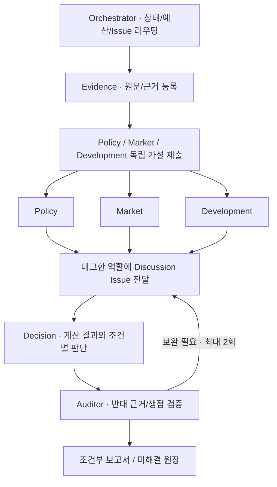

# Estate buy or stay

[설계 초안](housing_research_harness_v0_1.md)을 실행 가능한 Python 하네스로 구현했습니다. 연구 대상은 전농·청량리, 수지구청·성복, 구성역의 매수·임대 유지 조건입니다. 사용자 조건은 초안에서 옮겼으며 미확인 자산·소득·대출 입력은 `null`로 유지합니다.

**GitHub Issues가 에이전트 간 논의 공간입니다.** 컨트롤러가 역할별 작업 이슈를 만들고, 태그된 역할을 실행하고, 근거·답변·감사를 같은 이슈 흐름에 기록합니다. 실행 상태와 복구 원장은 로컬 SQLite에 저장합니다.



## 설치와 데모

Python 3.11 이상, [uv](https://docs.astral.sh/uv/)가 필요합니다. 저장소 루트에서 실행합니다.

```bash
uv sync --python 3.12
uv run pytest -q
uv run estate-harness demo --run-id demo-001
uv run estate-harness status --run-id demo-001
```

데모는 모델·네트워크 호출이 없는 fixture입니다. Evidence → 가설 3개 → 분석 3개 → Market이 요청한 Policy·Development 답변 → Decision → Auditor의 11개 작업을 실행합니다. 실제 가격·수급·정책을 조사한 결과로 사용하지 않습니다.

- `runs/demo-001/report.md`: 검증 상태가 표시된 보고서
- `runs/demo-001/github-fixture.json`: 실제 GitHub와 같은 이슈/댓글 구조의 로컬 기록
- `runs/demo-001/state.sqlite`: 실행 상태의 정본
- `runs/demo-001/{task,evidence,claim,finding,discussion,usage}.json`: 원장 내보내기
- `runs/demo-001/snapshot.json`: 고정한 조건·역할 지침·코드 버전

실행 후 같은 run을 `resume`하면 확정된 작업은 다시 실행하지 않습니다. 설정이나 코드가 바뀌었으면 새 run ID를 사용합니다.

## GitHub 연결과 실제 연구

대상 저장소는 `thuako/estate-buy-or-stay`입니다. **Git의 SSH 인증과 Issues API 인증은 별도입니다.** `gh`에 이 저장소 쓰기 권한이 있는 계정이 로그인되어야 합니다. Issues가 활성화되어 있어야 합니다.

```bash
gh auth login --hostname github.com --git-protocol ssh --web
gh repo view thuako/estate-buy-or-stay
codex login
uv run estate-harness doctor
```

`config/harness.toml`의 기준일·상한과 `config/profile.json`의 조건을 확인한 뒤 실행합니다. Codex 모델을 지정하려면 TOML에 사용 가능한 `model`을 넣습니다. 생략하면 CLI 기본 모델을 사용합니다.

```bash
# GitHub에 상위 연구 1개와 역할 이슈 7개 생성. 모델 호출 없음.
uv run estate-harness start --run-id housing-20260907 --plan-only

# 실제 연구 실행 및 중단한 작업 재개
uv run estate-harness resume --run-id housing-20260907

# 새 댓글에서 역할 태그를 작업 큐에 등록
uv run estate-harness sync --run-id housing-20260907

# 20초 간격으로 10회 확인; 새 작업 실행. Ctrl-C로 종료 가능.
uv run estate-harness watch --run-id housing-20260907 --cycles 10
```

`start`에서 `--plan-only`를 생략하면 바로 실제 연구를 실행합니다. 이미 생성한 run에서 GitHub 접근 오류가 났다면 인증 후 `resume`하면 됩니다.

현재 모델 어댑터는 **Codex CLI 계정 인증**을 사용합니다. API 키 결제 실행은 달러 비용을 사전 예약하는 어댑터가 구현되기 전까지 차단합니다. CLI 계정 사용량의 USD 비용은 `unknown`이며 0원이라고 기록하지 않습니다. `doctor`가 API 키 인증을 보고하면 계정 인증을 사용하는 별도 터미널에서 실행해야 합니다. 실제 모델 호출은 계정 사용량을 소모합니다.

Codex CLI 0.153.4의 `exec`, `--output-schema`, `--json`, `--ignore-user-config` 옵션을 기준으로 작성했습니다. workers는 별도 임시 디렉터리·읽기 전용 sandbox에서 웹 검색을 사용하고, shell·앱·플러그인·하위 에이전트·hook 기능을 비활성화합니다. SQLite와 GitHub 쓰기는 컨트롤러가 수행합니다. CLI 호출 형식은 [공식 비대화형 실행 문서](https://learn.chatgpt.com/docs/non-interactive-mode)를 참고했습니다.

## 에이전트끼리 소통하는 방법

등록된 연구·역할·논의 이슈에 다음과 같이 댓글을 남깁니다.

```text
@agent-policy @agent-market
이 거래가격 비교에 적용한 대출 규제의 시행일과 실제 적용 대상을 대조해 주세요.
근거가 다르면 주장 ID와 원문 위치를 제시해 주세요.
```

지원 역할: `orchestrator`, `evidence`, `policy`, `market`, `development`, `decision`, `auditor`.

- `@agent-policy`는 하네스가 읽는 **논리 주소**입니다. 역할마다 GitHub 계정을 만들 필요가 없습니다. 이 주소 자체에 GitHub 알림 배달을 의존하지 않습니다.
- 이슈에는 `agent:policy` 같은 역할 label을 붙입니다. 실제 계정에 알림이 필요하면 `[github_logins]`에 `policy = "실제-봇-login"`을 설정합니다.
- 에이전트는 `discussion_requests`로 대상 역할·질문·주장 ID를 반환합니다. 컨트롤러가 논의 이슈를 만들고 요청자·대상 역할 이슈에 링크를 남깁니다. 답변은 논의 이슈에 게시됩니다.
- Decision이 추가 논의를 요청하면 답변 후 판단과 감사를 다시 수행합니다. `answered`는 답변이 도착했다는 뜻이며 쟁점 해결 판정은 Auditor가 합니다.
- 저장소 OWNER/MEMBER/COLLABORATOR 또는 `allowed_github_users`의 댓글만 실행을 유발합니다. 하네스 자체 댓글은 다시 태그 작업으로 읽지 않습니다.
- `sync`는 해당 run에 등록된 이슈를 읽습니다. 사람이 별도로 만든 이슈는 등록된 역할 이슈 댓글에서 링크와 태그로 전달합니다. 동일 댓글·동일 내용·동일 역할은 한 번만 처리하며 편집된 내용은 새 작업입니다.
- `watch` 또는 `resume`을 실행 중이어야 답변이 생성됩니다. 서버나 GitHub Actions의 무인 연구는 자동으로 켜지지 않습니다. CI는 오프라인 검증만 수행합니다.

## 실행·근거 검증

초기 Policy·Market·Development는 공통 Evidence만 보고 독립 가설을 먼저 제출합니다. 모든 가설이 완료되면 분석을 시작하며 다른 역할의 첫 분석은 입력에서 숨깁니다. 동시 worker는 최대 3개입니다.

설정의 기본 상한은 에이전트 호출 24회, 관측 도구 호출 60회, 누적 실행 30분, 작업당 5분, 시도 3회, 재논의 2회입니다. 시도·예산은 재개해도 초기화하지 않습니다. Codex의 이벤트 단위로 도구 시작을 관측하므로, 서비스 내부 검색 요청 개수나 토큰별 실시간 사용량을 정확히 제한하는 기능은 아닙니다. 상한을 넘는 이벤트가 감지되면 worker를 종료합니다. 강제 종료로 사용량을 알 수 없는 실행은 예약한 잔여 도구 예산과 작업 시간 상한을 보수적으로 차감합니다.

단일 호스트·단일 컨트롤러를 전제로 `flock`과 SQLite 트랜잭션을 사용합니다. 영구 outbox와 GitHub marker를 대조하여 응답 유실 후 중복 생성 가능성을 줄입니다. 여러 호스트에서 같은 run을 실행하는 분산 큐는 지원하지 않습니다. [GitHub Issues REST API](https://docs.github.com/en/rest/issues/issues)와 [댓글 API](https://docs.github.com/en/rest/issues/comments)를 사용합니다.

Pydantic 스키마와 코드 검증은 존재하지 않는 참조, 미래 근거, 숫자 주장의 단위·기간·대상 누락, 검증되지 않은 근거 인용, 대표적인 수치 확률 표현을 차단합니다. 이 검증만으로 원문이 주장을 실제 지지함을 증명하지는 않습니다. Auditor의 원문 대조와 미해결 쟁점 원장을 함께 사용합니다. 중대 쟁점은 다음 감사가 생략해도 남으며 Auditor가 해결 이유를 명시해야 닫힙니다.

원문 파일은 명시적으로 수집할 수 있습니다. 원문 HTTP 응답 bytes·SHA-256·취득 시간·ETag와 상태를 저장합니다. 404와 취득 실패를 거래 0건으로 해석하지 않습니다.

```bash
uv run estate-harness collect-source 'https://example.org/original-report.pdf'
uv run estate-harness invalidate --run-id housing-20260907 \
  --evidence-id 'evidence:source-1' --reason '정책 원문 개정 확인'
uv run estate-harness resume --run-id housing-20260907
```

원문 개정은 참조 주장을 `stale`로 만들고 Evidence 재확인과 Decision·Auditor 재검토를 등록합니다. 다른 claim은 보존합니다. 새로운 원자료는 새 evidence ID로 등록합니다. 지역 모형의 자동 재추정과 전체 데이터 의존 그래프는 후속 구현 범위입니다. `collect-source`의 파일은 별도 보존용이며 자동으로 검증된 EvidenceRecord로 승격되지 않습니다.

## 계산기

```bash
uv run estate-harness calculate examples/scenario.json
uv run estate-harness demo --run-id scenario-demo --scenario examples/scenario.json
```

예제는 모두 합성 입력입니다. 실제 매물가격이나 세율·대출 규칙으로 사용하지 않습니다.

| 모듈 | 결과 |
| --- | --- |
| `valuation` | 현재·24·36개월별 순임대료 DCF와 잔존가치 민감도 |
| `pricing_horizon` | 가격이 가치 경로와 처음 만나는 관측 월, 미도달·비단조·재하락 표시 |
| `stock` | 초기 재고 + 준공 − 멸실 + 순용도전환, 공실 출회 중복 차단 |
| `household` | 즉시·만기·24개월·36개월 매수와 임대 유지의 동일 초기자산·종료시점 비교 |
| `break_even` | 주어진 탐색 범위 안에서 매수·임대 순자산 차이가 바뀌는 가격 |

원금 상환은 현금과 부채에 한 번씩 반영합니다. 비교 전략의 운용수익 외에 자기자금 기회비용을 다시 차감하지 않습니다. 자금·소득·확인된 대출 조건이 없으면 가계 적합성은 `unknown`입니다. 현재 구현은 고정 임대조건·고정금리 원리금균등·명시적 가격경로를 사용하는 조건부 산술입니다. 거래 수집 API와 수급→임대료 계수 추정, 보정된 확률 모형, single-agent 대조 실험은 아직 구현하지 않았습니다.

## 디렉터리

`src/estate_harness/`에는 `schemas.py`, `validation.py`, `workflow.py`, `store.py`, `adapters/`, `collectors/`, `calculators/`가 있습니다. `roles/`는 버전 고정 역할 지침, `tests/`는 실행·전송·계산·근거 검증, `evals/`는 초안의 평가 범위와 남은 과제를 기록합니다. `runs/`와 인증정보는 Git에 올리지 않습니다.
