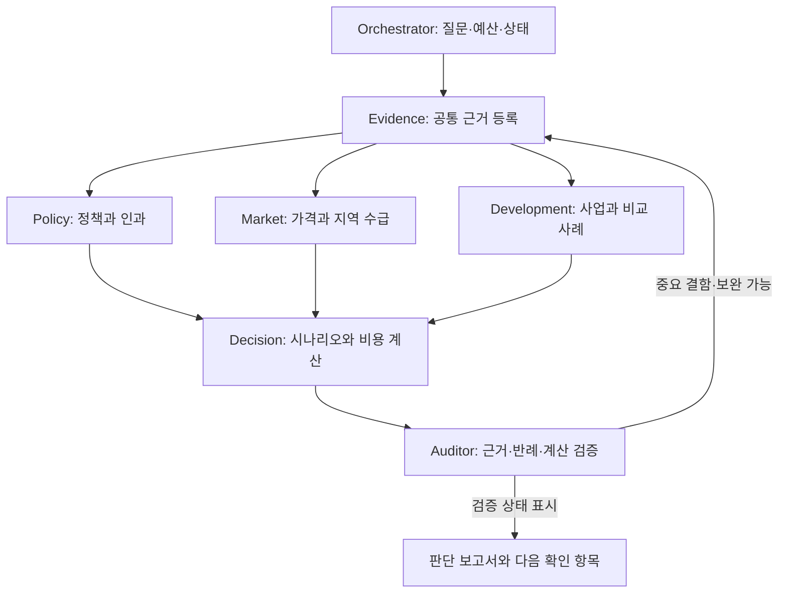

**부동산 정책·지역 가치·매수 시점 연구를 위한 multi-agent harness 초안 v0.1**

작성일: 2026-09-07. 설계 초안이며 실행 엔진이나 검증된 가격 예측 모델을 구현한 상태는 아닙니다. 아래 구성·기준·예산은 초기 설계 제안입니다. 현재 부동산 정책과 가격에 대한 새로운 예측 보고서가 아닙니다.

이 harness는 “어느 주장이 어떤 근거와 가정 때문에 성립하며, 그중 무엇이 바뀌면 내 매수 결정도 바뀌는가?”를 추적합니다. 최종 출력에는 추천 행동뿐 아니라 반대 근거, 조건별 손익, 미해결 질문, 다음 확인 항목을 함께 남깁니다.

**첫 실행은 지금까지의 대화를 검증할 가설로 변환하는 데서 시작합니다.** 이전 assistant 답변의 가격·금리·정책·확률은 출처가 붙어 있어도 재사용 전 검증 대상으로 등록합니다. 사용자 요구조건, 외부 관측값, assistant의 해석을 서로 다른 타입으로 저장합니다. 대화에서 반복된 주장이 관측 사실로 승격되어서는 안 됩니다.

| 기존 질문 | 연구 질문으로 재정의 | 필요한 결과 |
| --- | --- | --- |
| 정부가 정책을 건드릴 때마다 집값이 오른다 | 어떤 정책이 어떤 경로로 어느 시장의 수요·매물·입주·가격에 영향을 주었는가? 정책 이전 상승과 다른 원인을 분리할 수 있는가? | 정책별 효과 경로, 식별 가능한 인과효과와 불가능한 부분 |
| 2~3년 안에 정상 우상향으로 돌아오는가 | 상승률 둔화, 현재 대비 명목가격 하락, 모형상 추세 복귀, 소득 대비 부담 개선 중 무엇을 뜻하는가? | 정의별 24개월·36개월 전망과 검증 가능한 사건 |
| 큰정부 기조가 유지되는가 | 신용·세금·거래·공공공급·민간사업 규제에서 개입의 수준과 방향은 어떻게 달라지는가? | 정책 수단별 시나리오, 시행 상태, 변경 조건 |
| 전농·청량리, 수지, 구성 중 어디가 나은가 | 현재 실제 매수가에서 생활 효용·추가 비용·하방 위험·상승 여력은 어떻게 다른가? | 지역 평균 설명과 별개인 단지·매물별 비교 |
| 플랫폼시티는 성공할 것인가 | 사업 진행, 기업 입주, 고용 창출, 상권 정착을 언제까지 어느 수준이면 성공으로 볼 것인가? | 단계별 성공·지연·축소 조건 및 주택가격 전달 경로 |
| 지금 살까, 기다릴까 | 동일한 초기 자산과 동일한 평가 시점에서 각 주거 전략의 현금흐름·순자산·거주 효용은 어떤가? | 조건별 손익분기 매수가와 선택이 바뀌는 지점 |

수요·공급 분석에는 물리적인 주택 재고뿐 아니라 대출 가능 구매력, 매도 가능한 매물, 임대차 수요, 입주 시차를 포함합니다. 정부 개입이라는 한 단어로 이 변수들의 방향을 합치지 않습니다.

**사용자 조건은 출처와 미확인 항목을 함께 저장합니다.** 현재 대화에서 확보한 조건을 다음과 같이 초기화하되 실행 시점을 기준으로 변경 여부를 기록합니다. 모든 미확인 값을 한꺼번에 질문할 필요는 없습니다. 추천이 실제로 달라지는 항목부터 확인합니다.

```yaml
schema_version: "0.1"
research_as_of: "2026-09-07"
timezone: Asia/Seoul
profile:
  max_purchase_price_krw: 1100000000
  transaction_costs_included_in_budget: null
  commute_destinations: [판교, 신사]
  current_home: 잠원동 신반포2차
  current_lease_end_month: "2027-04"
  family_plan: "3년 내 출산을 고려하고 초등학교 시점의 거주·자산 가치를 함께 평가"
  candidate_areas: [전농·청량리, 수지구청, 성복, 구성역]
  candidate_complex_names: [신정마을9단지, 블루밍구성더센트럴]
  liquid_assets_krw: null
  current_jeonse_deposit_krw: null
  deposit_available_date: null
  annual_household_income_krw: null
  existing_debt: null
  lender_confirmed_borrowing_capacity: null
  monthly_housing_payment_limit_krw: null
  emergency_reserve_krw: null
  minimum_area_sqm: null
  expected_holding_years: null
  maximum_commute_minutes: null
  provenance: user_conversation
decisions:
  - buy_before_current_lease_ends
  - buy_around_current_lease_end
  - rent_then_buy_after_24_months
  - rent_then_buy_after_36_months
research_horizons_months: [24, 36]
decision_valuation_horizon_years: null
```

위 가격 상한이 총 취득비용을 포함하는지, 기존 보증금을 언제 회수할 수 있는지, 잔금일의 대출 실행 가능성이 특히 중요합니다. 지역 연구는 이 값이 없어도 진행하지만, 가계의 최종 매수 가능 여부는 미확인 상태로 남깁니다. 전농·청량리와 성복의 개별 단지는 예산·면적·통근 조건으로 후보를 확정하며 이전 답변에 등장했다는 이유만으로 채택하지 않습니다.

**초기 구조는 Orchestrator 하나와 전문 역할 여섯 개로 구성합니다.** 역할 수와 동시에 실행하는 프로세스 수는 다릅니다. 초기 병렬 실행은 정책·시장·개발 분석 세 갈래로 제한하고, 모든 역할을 항상 호출하지 않습니다.



| 역할 | 책임 | 정해진 산출물 | 책임 범위의 경계 |
| --- | --- | --- | --- |
| Orchestrator | 질문 분해, 의존성, 실행·비용 제한, 재조사 우선순위 | TaskSpec, run 상태, 작업별 예산 | 계획은 LLM이 제안하되 실행 조건·재시도·검증 규칙은 코드가 집행 |
| Evidence Agent | 원문 수집, 출처 계보, 날짜·단위·단지 식별, 데이터 버전 | EvidenceRecord, PolicyEvent, 정제 데이터 manifest | 근거 등록을 맡으며 가격 전망을 확정하지 않음 |
| Policy Agent | 정책 경로, 반대 효과, 정책 변경 조건, 인과 식별 가능성 | 가설별 지지·반박 근거, 추정 설계 | 발표 전후 차이를 인과효과로 단정하지 않음 |
| Market Agent | 단지·면적별 거래·호가·임대료, 가구·입주·멸실 전망, 기본가치 모형의 입력과 가정 | 비교 가능한 가격 범위, 수급 전망, 기본가치 범위, 이상치 목록 | 계산 모듈로 추정하며 전국 평균으로 특정 매물의 적정가격을 정하지 않음 |
| Development Agent | 개발사업 단계, 확약 수준, 지연 위험, 실패 포함 비교 사례 | 단계별 milestone, 조건부 시나리오 | 사업 성공 확률과 해당 아파트 상승 확률을 구분 |
| Decision Agent | 가계 전략 비교, 민감도, 생활 효용, 판단 변경 조건 | DecisionTable, scenario 입력, break-even 결과 | 숫자 계산은 버전 관리된 계산 모듈에 위임 |
| Auditor | 출처·시점·가설·계산 반례 검증, 미해결 충돌 관리 | IssueRecord, claim별 검증 상태 | 다수결로 전망을 결정하거나 근거 없이 문구만 절충하지 않음 |

보고서 문장 작성은 Decision Agent의 후속 단계로 처리합니다. 새로운 사실이나 전망은 보고서 작성 단계에서 추가할 수 없습니다. Auditor의 최종 검토 이후 문장에 숫자나 의미가 바뀌면 해당 주장 검증을 다시 수행합니다.

공통 원문과 데이터는 한 번 수집해 참조 ID로 공유합니다. 각 분석 Agent는 서로의 첫 결론을 보기 전에 가설·예측 경로·반증 조건을 제출합니다. 그 후 차이를 비교합니다. Evidence Agent의 수집 편향을 막기 위해 Auditor는 중요 주장에 대해 원문을 독립적으로 다시 열고, 필요한 반대 자료를 직접 찾을 수 있습니다. 이 결과도 공통 저장소에 등록합니다.

이 구조는 작업 경계, 외부 상태 저장, 결과를 참조로 전달하는 방식을 권장한 [Anthropic의 multi-agent 연구 시스템 설명](https://www.anthropic.com/engineering/multi-agent-research-system)을 참고했습니다. 해당 시스템의 성능·비용 수치를 이 부동산 연구에 그대로 적용하지 않습니다. 여기의 역할 분할과 검증 규칙은 본 초안의 제안입니다.

**데이터의 기본 단위는 보고서 문단보다 작은 ‘검증 가능한 주장’입니다.** 주장은 관측 사실, 사용자 입력, 계산 결과, 인과 해석, 전망, 의사결정으로 구분합니다. 숫자가 담긴 주장은 단위·기간·지리·면적·통계 방식이 빠지면 확정할 수 없습니다.

| 계약 | 핵심 필드 |
| --- | --- |
| TaskSpec | task_id, run_id, question_ids, owner_role, dependencies, input_refs, expected_output_schema, acceptance_checks, budget, prompt_version |
| EvidenceRecord | evidence_id, original_publisher, original_url, retrieved_at, published_at, observation_period, first_seen_at, revision_id, content_hash, locator, source_family_id, coverage_limitations |
| ClaimRecord | claim_id, statement, claim_type, geography_id, complex_id, area_sqm, period, unit, statistic, evidence_refs, calculation_ref, assumptions, counterevidence_refs, status |
| PolicyEvent | policy_id, instrument, target_group, proposal_date, announcement_date, enactment_date, effective_date, expiry_date, status, supersedes_policy_id, expected_channels, evidence_refs |
| ForecastRecord | event_id, definition_version, forecast_as_of, evaluation_date, target_id, horizon, method, training_cutoff, probability_or_interval, calibration_evidence, scenario_assumptions, resolution_rule |
| IssueRecord | issue_id, affected_claim_ids, issue_type, severity, competing_explanations, requested_evidence, owner, status, resolution_reason |
| RunCheckpoint | run_id, schema_version, profile_version, source_snapshot_id, completed_tasks, pending_tasks, task_attempts, prompt_versions, code_version, costs, next_action |

같은 원문을 인용한 여러 기사는 하나의 출처 계보로 묶습니다. 같은 통계 발표를 옮긴 기사 다섯 개를 독립적인 관측 다섯 개로 세지 않습니다. EvidenceRecord의 locator에는 PDF 페이지·표 번호, HTML 구간, API 조회 범위와 행 식별 정보를 남깁니다. 원문을 확보하지 못하면 `unverified`로 유지합니다. API에 공개 시점이나 완전한 개정 이력이 없으면 그 제약도 기록합니다.

**데이터별로 취득 경로와 사용할 수 있는 범위를 정합니다.** 취득 실패를 거래 0건으로 해석하지 않습니다.

| 데이터 | 우선 취득 경로 | 처리 기준 | 미확보 시 처리 |
| --- | --- | --- | --- |
| 매매·임대차 실거래 | 국토교통부 API | 계약일, 해제·정정, 면적, 층, 거래 유형, 임대차 계약 유형 구분 | 출처가 있는 보조 집계를 사용하되 원자료 대조 미완료 표시 |
| 현재 매물 | 이용 가능한 정식 데이터, 사용자 매물 목록, 이미 확보한 중개 자료 | 중복 매물, 호가, 협상가, 확인일, 입주 가능일 구분 | 현재 실제 매수 가능 가격은 미확인으로 표시 |
| 가구·이동·주택 재고 | 국가 통계와 지역 통계 | 인구와 가구 구분, 순이동 중복 합산 방지, 주택 유형 구분 | 지역별 정밀 수급 판정을 제한 |
| 금리·물가·소득·가격지수 | 한국은행·국가 통계·한국부동산원·KB 원표 | 명목·실질, 기간, 모집단, 개정 구분 | 분석 가능한 범위만 사용 |
| 정책 | 소관 부처·법령·고시·금융기관 조건 | 제안·성립·시행·철회·경과조치 구분 | 시행 중이라고 간주하지 않음 |
| 공급 | 사업별 공정·입주 예정 자료 | 계획·착공·준공 중복 합산 방지, 멸실 별도 처리 | 부족 물량을 임의로 확정하지 않음 |
| 개발 | 사업 주체·지자체·입찰·계약 자료 | 구상·MOU·구속력 있는 계약·착공·가동 구분 | 기업명 미발표는 미확정으로 유지 |

매매 API는 지역 코드와 계약 연월을 기준으로 조회합니다. 비공개 속성이 있어 완전히 동일한 주택의 반복 매매를 식별할 수 있다고 가정하지 않습니다. [매매 API 공개 사양](https://www.data.go.kr/en/data/15126469/openapi.do)

임대차 API는 동·호 정보가 공개되지 않는 제약이 있으므로 매매와 전세를 완전히 같은 주택으로 대응시키지 않습니다. 해제·신규·갱신 등의 세부 필드는 구현 시 기술 문서와 실제 응답을 확인합니다. 식별되지 않는 계약 유형은 `unknown`으로 남깁니다. [임대차 API 공개 사양](https://www.data.go.kr/data/15126474/openapi.do)

**추가 요청을 반영한 최상위 산출물은 ‘현재 가격이 몇 년 뒤의 기본가치를 반영하는가’입니다.** 단순한 추세선 연장으로 결론 내리지 않고, 수급에서 임대료·기본가치로 연결하는 모듈을 둡니다. 다음 식은 모델 설계이며 계수를 추정하거나 실제 예측을 완료한 결과가 아닙니다.

1. 지역·면적대별 향후 거주 수요를 추정합니다.
2. 같은 범위의 입주·멸실·사용 가능한 재고와 공실을 추정합니다.
3. 수급과 소득으로 임대료 경로를 추정합니다.
4. 금리·유지비·위험 보상·개발 조건을 반영해 기본가치의 범위를 구합니다.
5. 현재 실제 매수가를 현재·24개월 후·36개월 후 기본가치와 비교합니다.

수요 모듈의 초기 구조는 다음과 같습니다.

\[
D_{r,t}=\sum_g H_{r,g,t}\Pr(\text{대상 아파트 선택}\mid g,\text{소득},\text{임대료},\text{통근},\text{주택 특성})
\]

여기서 H는 지역 r의 가구 유형 g별 가구 수입니다. 확률은 임의의 선호 점수가 아니라 주거 선택 자료로 추정하거나 범위를 설정해야 하는 항목입니다. 가구 추계에 이미 반영된 순이동을 다시 더하지 않습니다. 취업자 유입을 그대로 같은 수의 신규 가구로 바꾸거나, 1인 가구 증가를 모두 중형 아파트 수요로 바꾸지 않습니다. 매수 의향·투자 수요와 실제 거주에 필요한 주택 수는 별도 변수입니다.

공급 모듈은 물리적인 재고를 먼저 계산합니다.

\[
S_{r,t+1}=S_{r,t}+\text{준공}_{r,t}-\text{멸실}_{r,t}+\text{순용도전환}_{r,t}
\]

이미 재고에 포함된 빈집이 시장에 나왔다고 S에 다시 더하지 않습니다. 공실률과 사용 가능한 공실은 별도 상태로 관리합니다. 주변 지역 공급은 통근·가격대·면적에 따른 대체 가능성을 적용하며, 전국 합계에서는 같은 주택을 여러 번 세지 않습니다. 정비사업 이주 수요와 멸실도 같은 경로에서 두 번 세지 않도록 점검합니다.

공급량은 사업별 입주 예정일과 공정, 취소·지연 조건으로 정상·지연·축소 시나리오를 만듭니다. 2029년 입주 자료가 없으면 발표한 착공 목표를 대신 넣지 않고, 착공 코호트와 공사 기간 자료로 범위를 추정합니다. 사업별 일정 확률을 임의로 부여하지 않습니다.

수급을 가격으로 바꾸는 계수는 반드시 별도로 추정합니다. ‘가구 1% 증가 → 가격 1% 상승’ 같은 등식은 사용하지 않습니다. 첫 모형은 지역 패널의 임대료·공실 변화와 가구·재고·소득의 관계로 구성하고, 가격을 예측하는 데 유용한 관계와 인과효과를 구분합니다. 표본이 부족하면 지역 수준 계수를 단지 특성으로 조정하되 불확실성을 넓힙니다.

기본가치는 예상 순주거 임대료를 자산가치로 환산하는 모형과 가격·소득·임대료의 장기 관계를 교차 검토합니다. 전세보증금 자체를 연간 임대료로 넣지 않습니다. 보증금의 자금 비용, 월세, 전월세 전환 조건을 구분하며 정책·신용 위험의 영향을 반영합니다.

\[
F_t=\sum_{j=1}^{J}\frac{E_t[\text{순임대료}_{t+j}]}{\prod_{k=1}^{j}(1+d_{t+k})}
+\frac{E_t[TV_{t+J}]}{\prod_{k=1}^{J}(1+d_{t+k})}
\]

F는 모형이 추정한 기본가치, d는 위험 보상 등을 포함한 할인율, TV는 잔존가치입니다. 2~3년만 임대료를 할인해서 아파트 전체 가치를 구하지 않습니다. 잔존가치가 결과 대부분을 결정하면 그 민감도를 명시합니다. 토지·건물 노후화·재건축 선택권과 추가 분담금을 고려하되 이미 임대료나 잔존가치에 반영한 개발 효과를 재가산하지 않습니다.

‘정책이 전혀 없는 정상 시장’은 기준 상태로 쓰지 않습니다. 정책은 이미 공급·대출·세금·주거 선택에 영향을 주고 있기 때문입니다. 시행 중인 제도를 유지하는 기준 시나리오와 특정 조치를 변경하는 반사실 시나리오를 비교합니다. 기본가치 모형으로 설명되지 않는 잔차를 전부 정책 효과나 거품이라고 부르지 않습니다.

현재 가격 P와 미래 기본가치 F의 비교 지표는 다음과 같습니다.

\[
\text{미래가치 대비 괴리율}_h=P_t/F_{t+h}-1
\]

\[
\tau=\inf\{h\ge0:F_{t+h}\ge P_t\}
\]

첫 지표는 현재 가격이 미래 명목 기본가치를 얼마나 웃도는지, 두 번째는 기본가치가 현재 가격을 따라잡는 데 필요한 기간을 나타냅니다. 둘 다 기준 시나리오와 모형에 의존합니다. F의 경로가 단조롭지 않거나 예측 구간 안에서 교차하지 않으면 ‘해당 기간 내 미도달’로 표시합니다. 상·하한 경로가 서로 다른 판정을 내리면 판정 범위를 함께 냅니다.

현재 가격이 3년 후 기본가치와 같다는 사실은 현재 구매가 경제적으로 유리하다는 뜻이 아닙니다. 해당 기간의 주거 효용, 이자, 기회비용, 유지비를 포함한 매수·임대 비교는 Decision 계산기가 별도로 수행합니다.

| 출력 | 정의 | 책임 |
| --- | --- | --- |
| SupplyDemandRecord | 지역·주택 유형·기간별 가구, 재고, 입주, 멸실, 공실, 출처, 시나리오 | Market Agent와 계산 모듈 |
| ValuationRecord | 현재·24개월·36개월 기본가치 범위, 할인율, 임대료 경로, 잔존가치, 모형·데이터 버전 | Market Agent와 계산 모듈 |
| PricingHorizonRecord | 현재 매수가, 선반영 기간 범위, 미래 기본가치 대비 괴리율, 민감도 | Decision Agent |
| ValidationRecord | 기준 기간 변경, 단순 모형 비교, 외삽 범위, 주요 계수와 불확실성 | Auditor |

**가정을 넣은 산술과 실제 고평가 판정은 결과 화면에서 구분합니다.** 예를 들어 오늘 기본가치가 8억이고 매수가가 10억이라면, 향후 기본가치가 연 4% 성장할 때 따라잡는 데 약 5.7년, 6%라면 3.8년, 8%라면 2.9년이 걸립니다. 이 예시의 가격과 성장률은 가정이며 실제 단지의 평가 결과가 아닙니다. 핵심 연구 대상은 8억과 성장률의 근거입니다.

**‘정상화’의 다른 의미도 분리해 보존합니다.** 상승률 둔화와 가격 하락, 기본가치 회복은 서로 다른 사건입니다.

| 질문 | 측정할 사건 | 주의점 |
| --- | --- | --- |
| 상승 속도가 안정되는가 | 동일 지역·품질 조정 지수의 12개월 상승률이 사전 지정한 참조 범위에 진입 | 기간·범위·지속 조건을 예측 전에 고정 |
| 지금보다 싸지는가 | 동일 비교 대상의 24·36개월 후 명목가격이 현재보다 낮음 | 지수 하락과 원하는 매물의 존재를 구분 |
| 과거 추세에 복귀하는가 | 고정한 모형의 추세 대비 잔차가 정한 범위 안으로 진입 | 모형에 대한 복귀이며 진정한 적정가격의 증명은 아님 |
| 주거 부담이 낮아지는가 | 필요 자기자금·상환액/소득·임대 대비 비용 개선 | 금리와 대출 조건에 따라 가격과 다른 방향 가능 |
| 정책 효과가 줄어드는가 | 특정 정책의 식별된 효과가 정한 범위 이하로 축소 | 가격만 보고 반사실 효과를 판정하지 않음 |

같은 대상의 명목·실질가격과 임대료·소득 대비 가격을 함께 봅니다. 단순 과거 평균, 추세선, 임대료 기반 모형 중 무엇을 택하는지에 따라 판정이 달라지는지 검사합니다. 다른 모형의 결과를 무조건 평균내어 하나의 정답으로 만들지 않습니다.

**정책의 인과 분석은 예측과 별도의 합격 조건을 둡니다.** 정책이 없어도 가격이 올랐을 가능성과 가격 상승 때문에 정책을 도입했을 가능성을 점검합니다. Policy Agent는 정책별 대상, 경로, 방향, 시차, 다른 설명, 반증 조건을 제출합니다.

비교 가능한 처치·비교 집단이 있으면 event study나 DiD를 검토합니다. 도입 전 추세, 선행 반응, 지역 간 파급, 동시 정책, 대상 선정의 내생성을 확인합니다. 시차 도입·효과의 이질성·규제의 해제와 재도입을 단순한 모형에 억지로 맞추지 않습니다. [Callaway·Sant’Anna의 DiD 설명](https://bcallaway11.github.io/did/articles/multi-period-did.html)은 방법과 가정을 확인하는 참고 자료이며 이 한국 주택시장에 대한 식별을 보장하지 않습니다.

타당한 비교 대상을 만들지 못하면 인과효과는 식별 불가로 표시하고 관련성·경로·조건부 전망을 제시합니다. 비유의 결과를 효과 없음의 증명으로, 작은 유의한 결과를 중요한 경제적 효과로 바꾸지 않습니다.

**개발사업의 성공과 아파트 수익은 별도로 평가합니다.** 플랫폼시티는 용지·기반시설·기업 유치·실가동·고용 단계로 나누고, 성공 기준과 기한을 비교 사례 탐색 전에 고정합니다. 계획 발표 당시 조건이 비슷했던 지연·축소·미달 사례도 포함합니다.

기업 입주가 성공해도 추가 주택 공급, 현재 가격에 반영된 기대, 단지와의 거리, 경쟁 신축에 따라 기존 아파트의 초과수익은 달라집니다. 전농·청량리의 재개발·교통과 수지의 학군·교통도 같은 원칙으로 평가합니다. 시나리오 가격에 이미 포함한 개발 효과를 다시 더하지 않습니다.

**확률은 Agent의 투표 비율로 만들지 않습니다.** 같은 원자료와 모델을 쓰는 여러 답변은 독립 관측이 아닙니다. 초기 버전은 검증되지 않은 점확률의 최종 출력을 비활성화합니다.

확률 출력에는 대상 사건, 기한, 모집단, 모델, 학습 시점, 기준 확률, 검증 결과, 표본 한계가 필요합니다. 먼저 조건부 시나리오와 민감도를 제공하고 지역·시점을 분리한 평가를 진행합니다. 주관적 시나리오 가중치를 쓰면 가정으로 표시하고 범위를 바꾸어 결론이 유지되는지 봅니다. 이를 통계적으로 보정된 확률이라고 부르지 않습니다.

**가계 판단은 같은 초기 자산과 같은 평가 종료일로 비교합니다.** 가격 전망을 확정하지 못해도 어떤 가격·금리에서 매수와 임대의 우열이 바뀌는지는 계산할 수 있습니다.

| 항목 | 처리 |
| --- | --- |
| 초기 자산 | 현금·기존 보증금·부채의 기준일 통일 |
| 매수 | 매수가, 취득비, 대출 실행일, 자기자금, 이자·원금, 보유·수선비, 매도비 |
| 임대 | 보증금, 전세대출, 월세, 갱신·이사비, 보증금 반환 조건, 남은 자금의 세후 운용 |
| 기다린 뒤 매수 | 대기 중 주거비·저축·운용과 미래 가격·금리·대출 가능액·취득비 |
| 종료 시점 | 주택가치−잔여부채+금융자산 또는 금융자산+반환 보증금−부채 |
| 생활 | 통근·출산 후 소득과 지출·면적·학군·이사 부담을 금전 결과와 나란히 표시 |
| 유동성 | 최대 월 상환액, 비상자금, 보증금 반환과 잔금일 차이 |

원금 상환은 현금 유출이지만 전액 소비 비용이 아닙니다. 부채 감소로 순자산에 반영합니다. 자기자금 기회비용과 임대 전략의 운용이익을 동시에 차감해 같은 차이를 두 번 세지 않습니다. 실제 현금흐름과 종료 자산·부채를 기본 계산 방식으로 사용합니다.

세율·LTV·DSR·예외·경과조치는 적용일과 가계 조건을 확인한 규칙으로 계산합니다. 현재의 대출 가능액이 미래 잔금일에도 보장된다고 가정하지 않습니다. 미확인 값은 범위를 넣어 계산하며 개별 심사 결과를 만들어내지 않습니다.

최종 행동은 ‘어느 가격 이하이고 어떤 자금 조건을 만족하면 매수’, ‘어떤 조건에서는 임대 유지’, ‘생활 조건을 만족하지 못하므로 후보 재선정’처럼 표현합니다. 사용자의 소득·자산이 없으면 지역 분석을 계속하되 가계 적합성은 미판정으로 남깁니다.

**실행 상태의 정본은 영구 저장소에 둡니다.** compaction 요약이나 subagent 세션 ID에 의존하지 않습니다. context는 저장된 지침·작업·원문·미해결 쟁점으로 복원할 수 있는 입력입니다.

```yaml
runtime_proposal:
  controller: explicit_state_machine
  workflow_backend_candidate: langgraph
  development_store: sqlite
  shared_service_store_candidate: postgresql
  analytical_data_format: parquet
  agent_spawn_policy: controller_only
  max_parallel_analysis_tasks: 3
  max_schema_repair_attempts_per_task: 2
  max_transport_retries_per_call: 2
  max_research_revision_rounds: 2
  total_tool_call_budget: 60
  max_run_wall_minutes: 30
  total_cost_budget_usd: null
  require_explicit_cost_budget_before_paid_run: true
  quantitative_probabilities_enabled: false
  external_person_messaging_enabled: false
  unattended_scheduling_enabled: false
```

숫자는 초기 운영 상한 제안이며 실측 최적값이 아닙니다. 설정된 전체 비용을 재계획·재시도로 초기화하지 않습니다. 예산 내에 중요한 쟁점을 해소하지 못하면 근거의 한계를 표시한 `completed_with_limits`로 종료합니다. 현재 이 설정으로 유료 실행이나 자동화를 시작한 상태는 아닙니다.

LangGraph는 상태 관리 후보입니다. 공식 문서가 구분하는 checkpoint와 장기 store를 적용할 수 있지만, 외부 처리의 정확히 한 번 실행을 보장한다고 간주하지 않고 작업별 멱등성을 따로 설계합니다. [LangGraph persistence](https://docs.langchain.com/oss/python/langgraph/persistence)

| 실행 불변조건 | 구현안 |
| --- | --- |
| 같은 작업의 중복 확정 방지 | task_id, input_hash, prompt_version, code_version 기반 키와 트랜잭션 |
| 재개 시 지침 유지 | 역할 지침 전문·버전, TaskSpec, 원문 참조, 미해결 issue를 다시 로드 |
| 세션 ID 소실 후 재개 | provider_session_id는 보조 값으로만 사용하고 task_id와 산출물로 복구 |
| 병렬 쓰기 충돌 방지 | 작업별 고유 산출물, controller만 canonical state 갱신 |
| 저장 중 장애 복구 | 임시 저장·hash 검증·확정 기록, 재시도 시 동일 산출물 대조 |
| 스키마 미달의 성공 처리 방지 | 기계 검증 후 완료 처리, 복구 한도 초과 시 failed_schema |
| 채점 기준 임의 완화 방지 | 실행 중 acceptance_checks 고정, 수정은 새 run 또는 버전으로 등록 |
| 장애와 정보 부재 구분 | unavailable, not_found, not_applicable, unknown 별도 처리 |
| 비용 추적 | provider·model·task, input/output/cache tokens, 가격표 버전, tool 비용 기록 |
| 필요한 부분만 갱신 | source→claim→valuation→scenario→decision 의존 관계로 stale 전파 |

이 구조는 이전 검증 Agent 작업에서 겪었던 지침·작업 상태 유실과 중복 분석에 대응합니다. 외부 산출물과 작은 완료 단위로 장기 작업을 이어가는 방식은 [Anthropic의 long-running harness 설명](https://www.anthropic.com/engineering/effective-harnesses-for-long-running-agents)을 참고했습니다. 부동산 연구에서의 효과는 별도로 평가합니다.

초기 구현은 단일 호스트와 controller를 가정합니다. 여러 호스트로 확장할 때 영구 큐, lease/heartbeat, 장애 감지, 동시 갱신을 추가합니다. MCP는 수집 도구를 연결하는 경계이며 작업 원장과 상태 머신을 대신하지 않습니다. 모델별 세션·token 정보는 adapter에 둡니다.

**재조사는 결론을 바꿀 수 있는 정보에 집중합니다.** Auditor는 출처 오류, 데이터 혼동, 계산 오류, 인과 비약, 가정 차이, 사용자 조건 부족을 구분합니다. 앞의 네 유형은 관련 주장 확정을 막고, 뒤의 두 유형은 조건별 결과 또는 입력 부족으로 표시합니다.

같은 미래 가격 전망이라도 자기자금·통근의 중요도 때문에 매수 선택이 달라질 수 있습니다. 이를 모순과 구분합니다. 반면 같은 대상·날짜·정의에 대해 반대되는 사실을 말하면 수정해야 합니다. 충돌마다 어느 근거나 가정을 바꾸면 해소되는지 기록합니다.

다음 검색은 ‘알게 되면 행동이 달라지는가’, ‘확인 가능한가’, ‘비용과 시간이 적절한가’로 우선순위를 정합니다. 정밀한 정보가치 계산이 불가능한 초기에는 이 정성 기준을 사용합니다. 형식적인 반론을 늘리기 위해 검색하지 않습니다.

**연구 품질과 예측력을 구분해서 평가합니다.** 문장의 설득력이나 Agent 간 일치율은 합격 기준이 아닙니다.

| 평가 층 | 검증 항목 | 기준 |
| --- | --- | --- |
| 데이터·계산 | 단위·기간·해제·중복·모집단·계산 일치 | 정답을 정할 수 있는 fixture와 assertion |
| 근거·논리 | 원문이 주장을 지지하는지, 인과 가정, 반대 자료, 미확인 표시 | 사람이 확인한 대표 질문. LLM judge만 정답으로 사용하지 않음 |
| 실행 | 재개·부분 실패·비용 상한·갱신 전파·충돌 | 장애 주입 후 최종 상태 검사 |
| 수급·가치 모형 | 가구·입주·임대료 예측 오차, 기본가치 민감도, 모형 간 차이 | 단순 추세와 횡보 baseline, 기간을 분리한 검증 |
| 가격·확률 전망 | 예측 오차, 구간 coverage, Brier score, calibration | 동일 자료와 예산의 단순 모델 비교 |
| 의사결정 | 순자산·현금흐름·생활 조건·하방 위험 | 같은 제약과 종료 시점. 사후 최고수익만 기준으로 삼지 않음 |
| multi-agent 효과 | 중요한 오류, 출처 정확도, 질문 충족, 비용·지연 | 동일 자료·모델 조건·총 예산의 single-agent와 같은 계산기 |

최근 24·36개월 전망의 정답은 아직 없습니다. 과거 walk-forward 평가에서는 그때 공개된 원자료와 개정 상태를 고정합니다. 현재 LLM이 과거의 결말을 이미 학습했을 수 있으므로 검색만 과거로 제한해도 미래 정보 혼입이 완전히 제거되지는 않습니다. 식별자 익명화 등의 민감도를 살피되 과거 평가만으로 순수 예측력을 입증하지 않습니다. 시점과 결과를 저장해 앞으로 채점하는 forward 평가를 병행합니다.

겹치는 예측 기간과 인접 지역은 독립 사례가 아닙니다. 지역·시점 블록 분리, 비중첩 기간, 실패를 포함한 비교 집단을 사용합니다. 몇 번의 정책 국면에서 정밀한 성공 확률을 만들지 않습니다.

**첫 평가 사례는 실제 대화에서 발생한 오류와 추가 수급 모듈의 실패를 재현합니다.** 아래는 설계용 fixture 목록이며 아직 테스트를 구현하거나 실행한 것은 아닙니다.

| ID | 문제 입력 | 기대 행동 |
| --- | --- | --- |
| E01 | 연간 평균과 다음 해 일부 기간 평균 차이를 전년 동기 상승률로 사용 | 기간 불일치 검출 |
| E02 | 신고가 한 건으로 단지 전체 시가 확정 | 표본·조건·후속 거래 부족 표시 |
| E03 | 전국·특정 단지, 명목·실질 혼합 | 별도 시계열로 분리 |
| E04 | 같은 발표를 옮긴 기사 세 개 | 독립 원자료 하나로 계산 |
| E05 | 세제 제안을 시행 중으로 설명 | 정책 상태에서 차단 |
| E06 | 계획·착공·입주 물량 합산 | 사업·공정 중복 검출 |
| E07 | 갱신·신규 임대료 혼합 | 계약 유형 구분, 불명 유지 |
| E08 | 해제 거래와 만원/원 단위 오류 | 제외·정정·단위 검증 |
| E09 | Agent 다수결로 성공 확률 생성 | 확률 출력 차단, 견해·가정 차이 표시 |
| E10 | 규제 후 상승만으로 정책 효과 단정 | 역인과·비교군·동시 충격 검토 요구 |
| E11 | 미래 발표·개정 자료가 과거 평가에 혼입 | 시점 조건으로 제외하거나 평가 무효 |
| E12 | 원금 상환을 비용과 잔여부채에 중복 반영 | 현금흐름과 자산·부채 일치 검사 |
| E13 | 기회비용과 비교 측 운용이익 이중 차감 | 계산 정의 수정 |
| E14 | context 초기화와 세션 ID 삭제 | 원장·산출물에서 재개 |
| E15 | 수집 후 결과 확정 직전 프로세스 종료 | 중복 확정 없이 재개 |
| E16 | 정책 원문 개정 | 관련 주장과 판단만 stale 처리 |
| E17 | 무제한 추가 조사 요구 | 전체 상한 준수, 미해결 표시 |
| E18 | 소득·대출 입력 없이 매수 가능 단정 | 지역 분석 계속, 가계 판정 보류 |
| E19 | 가구 추계와 순유입을 중복 합산 | 추계 구성 성분 검토 |
| E20 | 총 주택 재고에 빈집 출회를 재가산 | 재고와 가용 공실 구분 |
| E21 | 주택 부족률을 같은 비율의 가격 상승률로 변환 | 추정되지 않은 탄력성 검출 |
| E22 | 2025 평균을 검증 없이 적정가격으로 사용 | 가정 표시와 기준가 민감도 요구 |
| E23 | 기본가치 잔차를 모두 정책 거품으로 분류 | 원인 미식별 표시 |
| E24 | 현재 가격이 3년 후 기본가치와 같으므로 즉시 매수 권고 | 보유비와 주거 효용을 별도 계산 |

초기 합격 조건은 중요한 혼동을 최종 결과에 남기지 않는 것, 공개하는 핵심 수치에 근거나 재계산 가능한 식이 있는 것, 재개 후 상태·예산이 유지되는 것입니다. 이 fixture 통과만으로 예측 정확도나 multi-agent의 우수성을 주장하지 않습니다.

**우선 해결 과제는 판단을 바꾸는 영향에 따라 정렬합니다.**

| 우선도 | 문제 | 초기 대응 | 남는 한계 |
| --- | --- | --- | --- |
| P0 | 정상화·성공·고평가의 정의 | 대상·기한·측정법 고정 | 진정한 적정가격은 직접 관측 불가 |
| P0 | 수급을 가격으로 바꾸는 관계 | 임대료·공실·소득과 수급의 계수 추정, 다른 모형 대조 | 시기별 구조 변화와 표본 부족 |
| P0 | 기준가의 순환논리 | 현재 가격에 맞춘 모형으로 현재 가격을 정당화하지 않기 | 모형 선택·할인율 불확실성 |
| P0 | 실제 살 수 있는 매물과 자료의 차이 | 조건별 실거래·호가·협상가 분리 | 공개되지 않은 거래 협상 |
| P0 | 과거 답변·보조 집계 오류의 전파 | 미검증 claim으로 등록, 원문 독립 대조 | 원자료 자체 오류 가능 |
| P0 | 정책 인과와 예측의 혼동 | 효과 대상과 식별 가정 명시 | 유효 비교군 부재 |
| P0 | 가계 조건 부족 | null 유지, 선택이 바뀌는 입력부터 확인 | 개별 대출 심사 대체 불가 |
| P0 | 상태·지침 유실 | 영구 원장, 버전 고정, 복구 평가 | 외부 API·LLM 완전 재현 곤란 |
| P1 | Agent 동조·출처 편향 | 최초 독립 분석, 출처 계보, 독립 감사 | 모델을 바꿔도 통계적 독립 아님 |
| P1 | 적은 사례·미래 정보 | baseline, 시점 고정, 블록 검증, forward 평가 | 2~3년 예측 검증에 실제 시간 필요 |
| P1 | 중복 조사·무한 루프 | 수집 공유, 변경 부분 갱신, 전체 예산 | 공통 취득 단계의 병목 |
| P1 | 개발 성공과 가격 상승 혼동 | 진행 단계·현재 기대 반영·경쟁 공급 분리 | 비공개 기업 유치 정보 |
| P1 | 시나리오 조합의 모순 | 금리·소득·임대료·공급의 조건과 상호 의존 표시 | 시나리오 확률은 별도 문제 |
| P2 | multi-agent의 실질적 필요성 | 같은 예산의 single-agent 대조, 불필요 역할 제거 | 질문마다 최적 분업이 다름 |

**MVP는 한 번의 주거 의사결정을 끝까지 검증합니다.** 2027년 4월 전후의 결정을 위해 11억 원 이하 후보를 비교하고, 2028·2029년 수급·기본가치 경로와 더 긴 보유 기간의 가계 결과를 연결합니다. 내부 가격 단위는 KRW 정수로 통일합니다.

전농·청량리, 수지구청·성복, 구성역의 세 후보군에서 면적·생활 조건이 맞는 소수 단지를 고정합니다. 서로 다른 면적을 같은 상품으로 취급하지 않습니다. 조건이 맞지 않는 후보를 바꿀 때는 변경 이유를 기록합니다.

| 구현 순서 | 만드는 것 | 완료 판정 |
| --- | --- | --- |
| 1 | 설정·대상 식별·Evidence/Claim 원장·가격 데이터 처리 | 같은 자료로 같은 비교표 재계산 |
| 2 | 가구·공급·임대료·기본가치와 선반영 기간 계산 | 모든 계수가 출처 또는 가정으로 식별되고 민감도 출력 |
| 3 | 만기 전·만기 시점·24/36개월 대기 가계 계산기 | 어떤 입력에서 선택이 바뀌는지 설명 |
| 4 | 역할별 분석·감사·조건부 보고서 | 중요한 모순에 해결 또는 명시적 미해결 기록 |
| 5 | 장애 복구·변경 갱신·single-agent 대조 | 오류·비용·지연 차이 관측 |
| 6 | 개발 비교 사례·예측 원장 확대 | 확률 출력 가능한 부분과 불가능한 부분 구분 |

구현 시 `schemas/`, `roles/`, `adapters/`, `collectors/`, `calculators/`, `workflow/`, `evals/`를 분리합니다. `runs/`의 산출물과 자료 snapshot에는 버전과 참조를 남깁니다. 실제 API 이용 자격·대량 데이터 수집·모델 비용 상한·예측 계수는 아직 설정하거나 검증하지 않았습니다.

**완료 보고서는 다음 항목을 반드시 제공합니다.**

1. 기준일, 사용자 조건, 후보 매물 확인 상태.
2. 확인한 사실과 미확인·쟁점 정보.
3. 현재·24개월·36개월 수급과 기본가치 범위, 현재 가격의 선반영 기간.
4. 정책·금리·개발 가설과 반증 조건.
5. 매수·임대 조건별 현금흐름·순자산·생활 조건.
6. 추천 행동, 가격·자금 조건, 판단이 바뀌는 조건.
7. 추천에 대한 가장 강한 반대 근거와 처리 이유.
8. 다음 확인 항목 최대 세 개와 판단에 미치는 영향.
9. 이전 실행 대비 바뀐 근거·가정·결론, 총비용과 자료의 한계.

첫 버전의 가치는 사용자가 실제 매물가격과 대출 조건을 입력했을 때 같은 근거와 계산 규칙으로 일관된 판단을 반환하는 데 있습니다. 표본이나 인과 식별이 부족한 항목은 불확실성을 남기되, 가능한 수급 분석과 조건별 비용 계산을 완료합니다.

**초안을 작성하며 실제 원표로 확인한 기초 수급과 조건부 가격 검사는 다음과 같습니다.** 확인일은 2026-09-07입니다. 이 절은 완성된 기본가치 추정이 아니라, 구현 전 확보한 근거와 아직 검증해야 할 가정을 구분한 초기 조사 결과입니다.

2024년 12월 발표한 「장래가구추계 시도편: 2022~2052년」의 통계표 1, 인쇄 62쪽(PDF 65쪽)을 확인했습니다. 이 표는 2022년을 기준으로 작성한 일반가구 전망이며, 2026년 실제 실적에 맞춰 이번에 다시 추정한 값이 아닙니다. 반올림된 천 가구 단위 표에서 차이를 계산했으므로 아래 증가분도 근사값입니다. [공식 발표와 원표](https://mods.go.kr/board.es?act=view&bid=207&list_no=434134&mid=a10301020600&nPage=1)

| 지역 | 2026년 가구 수 | 2027년 증가 | 2028년 증가 | 2029년 증가 | 2026→2029 누적 증가 |
| --- | ---: | ---: | ---: | ---: | ---: |
| 전국 | 2,259.8만 | 20.9만 | 19.3만 | 18.1만 | 58.3만 |
| 서울 | 418.3만 | 1.9만 | 1.5만 | 1.2만 | 4.6만 |
| 경기 | 574.4만 | 9.2만 | 8.7만 | 8.3만 | 26.2만 |
| 인천 | 129.2만 | 2.0만 | 1.6만 | 1.5만 | 5.1만 |

같은 자료의 1인 가구 표(PDF 75쪽)는 전국 2026년 835.9만, 2029년 887.6만 가구를 전망합니다. 증가분 51.7만은 전체 순증 58.3만의 약 89%입니다. 이는 가구 증가가 대부분 1인 가구 증가로 구성된다는 의미이며, 1인 가구가 아파트를 사지 않는다는 뜻은 아닙니다. 연령·소득·기존 주택 점유와 면적별 선택을 나누어야 합니다. 서울과 경기의 가구 증가율을 특정 단지 가격 상승률로 바꾸는 계수는 아직 추정하지 않았습니다. [공식 가구 유형별 전망](https://mods.go.kr/board.es?act=view&bid=207&list_no=434134&mid=a10301020600&nPage=1)

공급은 한국부동산원·부동산R114의 2026년 8월 발표를 보도한 자료에서 다음 입주 전망을 확인했습니다. 공정 변동에 따라 실제 일정은 바뀔 수 있으며 2028년 하반기와 2029년 값은 이 자료에 없습니다. [입주 예정 물량 보도](https://www.asiatoday.co.kr/kn/view.php?key=20260831010010624)

| 지역 | 2026년 하반기 | 2027년 전체 | 2028년 상반기 |
| --- | ---: | ---: | ---: |
| 서울 | 18,994호 | 22,428호 | 8,246호 |
| 경기 | 29,036호 | 83,187호 | 39,120호 |

이 공급 표와 위의 가구 증가 표를 바로 빼서 부족분을 확정하지 않습니다. 가구 수는 모든 주거 유형을 포함하고 공급은 해당 공동주택 집계이며, 멸실·비아파트 공급·공실·주거 선호 이동·추계 이후 실제 인구 이동이 반영되어야 합니다. 현재 확인할 수 있는 방향은 ‘가구는 늘지만 증가 속도는 둔화한다’입니다. 아파트 전체의 물량 부족 또는 과잉과 가격의 적정성은 아직 별도 추정이 필요합니다.

현재 가격의 선반영 정도를 이해하기 위한 두 번째 검사는 실제 거래 집계에 가정을 넣은 산술입니다. 아래에서는 **2025년 연평균 거래가격이 당시 연평균 기본가치와 같았고 이후 연평균 기본가치가 매년 6% 성장한다고 가정**했습니다. 6%는 수급으로 추정한 성장률이 아니며, 2025년 가격의 적정성도 검증되지 않았습니다. 2026년은 각 자료 갱신일까지의 누계 평균이라 거래 구성과 기간 차이가 있습니다. 이 표를 실제 고평가율로 읽으면 안 됩니다.

| 단지·면적대 | 2025년 평균 | 2026년 누계 평균 | 가정상 2028년 기본가치 | 가정상 2029년 기본가치 |
| --- | ---: | ---: | ---: | ---: |
| 신정마을9단지 49㎡ | 7.02억 | 9.72억 | 8.36억 | 8.86억 |
| 전농삼성래미안 59㎡ | 7.43억 | 9.54억 | 8.85억 | 9.38억 |
| 블루밍구성더센트럴 84㎡대 | 7.66억 | 9.09억 | 9.12억 | 9.67억 |

위 입력은 국토부 공개 실거래를 집계한 민간 서비스의 연도별 평균입니다. 현재 매물의 매수가로 사용하지 않습니다. [신정마을9단지 집계](https://dapt.kr/아파트/경기도/용인시-수지구/풍덕천동/용인수지신정마을9단지/BGA011), [전농삼성래미안 집계](https://dapt.kr/아파트/서울특별시/동대문구/전농동/전농동삼성래미안/AkA033), [블루밍구성더센트럴 집계](https://dapt.kr/아파트/경기도/용인시-기흥구/마북동/블루밍구성더센트럴/BFA267)

이 가정에서 신정의 누계 평균은 2029년 기본가치보다 약 9.7% 높고, 전농은 약 1.7% 높으며, 구성은 2028년 기본가치와 비슷합니다. 같은 표가 시사하는 것은 단지별 선반영 정도를 구분해야 한다는 점입니다. 특히 구성의 최근 12.4억 한 건처럼 누계 평균에서 크게 벗어난 거래를 실제 매수가로 택하면 결과가 완전히 달라집니다. [구성 최근 거래 확인](https://liy.kr/region/gyeonggi/용인시-기흥구/마북동/블루밍구성더센트럴)

따라서 초기 판정은 ‘관심 단지가 모두 2~3년 뒤 가격을 비슷하게 반영했다는 설명은 성립하지 않는다’입니다. 실제로 3년 뒤 기본가치보다 고평가인지 확정하려면 지역·면적별 순수급, 신규 임대료 경로, 할인율, 실제 매수가를 검증해야 합니다. 이 미해결 부분을 Market·Policy·Development의 분석과 계산 모듈이 해결하도록 하는 것이 이번 harness의 핵심 연구 과제입니다.
